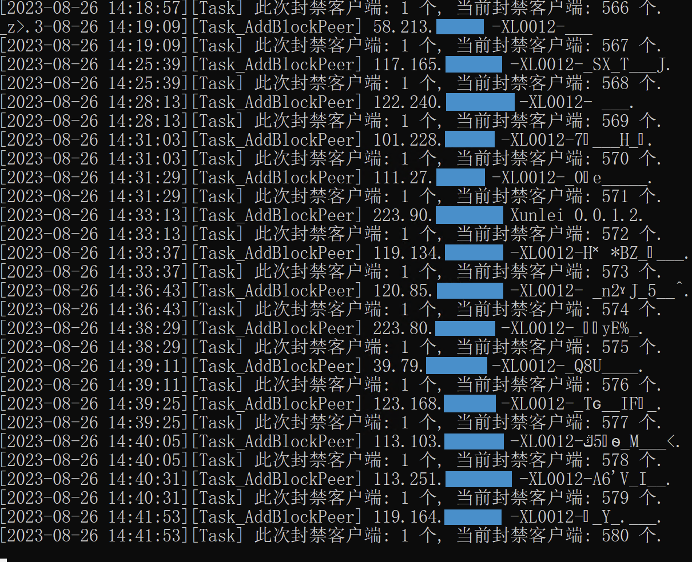

# qBittorrent-ClientBlocker

[中文 (默认, Beta 版本)](README.md) [English (Default, Beta Version)](README.en.md)  
[中文 (Public 正式版)](https://github.com/Simple-Tracker/qBittorrent-ClientBlocker/blob/master/README.md) [English (Public version)](https://github.com/Simple-Tracker/qBittorrent-ClientBlocker/blob/master/README.en.md)

A client blocker compatible with qBittorrent (4.1+)/Transmission (3.0+), which is prohibited to include but not limited to clients such as Xunlei.

-   Support many platforms
-   Support log and hot-reload config
-   Support ignore private ip
-   Support custom blockList (Case-Inensitive, Support regular expression)
-   Support client authentication
-   Support enhanced automatic ban (Default disable): Automatically ban peer based on the default or set related parameter
-   Under Windows, support show and hide window through the Ctrl+Alt+B window hotkey (Some users [feedback](https://github.com/Simple-Tracker/qBittorrent-ClientBlocker/issues/10) it may affect ban. Due to unknown reason, the function can be avoided if related problem are encountered)



## 使用 Usage

### Prerequisite

-   Client Web UI must be enabled.

### Use conventional version

1. Download compressed from [**GitHub Release**](https://github.com/Simple-Tracker/qBittorrent-ClientBlocker/releases) and decompress it;

    <details>
        <summary>View common platform download version of comparison table</summary>

        | OS       | Processor Arch | Processor Integers | Download Version | Note                                                                                    |
        | -------- | ----------     | ----------         | -------------    | ------------------------------------------------------                                  |
        | macOS    | ARM64          | 64-bit             | darwin-arm64     | Common in Apple M series                                                                |
        | macOS    | AMD64          | 64-bit             | darwin-amd64     | Common in Intel series                                                                  |
        | Windows  | AMD64          | 64-bit             | windows-amd64    | Common in most modern PC                                                                |
        | Windows  | i386           | 32-bit             | windows-386      | Occasionally on some old PC                                                             |
        | Windows  | ARM64          | 64-bit             | windows-arm64    | Common on new platform, it's applied to some tablet/notebooks/minority special hardware |
        | Windows  | ARMv6          | 32-bit             | windows-arm      | Rare platform, applied to some ancient hardware, such as Surface RT, etc                |
        | Linux    | AMD64          | 64-bit             | linux-amd64      | Common NAS and server                                                                   |
        | Linux    | i386           | 32-bit             | linux-386        | Rarely in some old NAS and server                                                       |
        | Linux    | ARM64          | 64-bit             | linux-arm64      | Common server and development board, such as Oracle or Raspberry Pi, etc                |
        | Linux    | ARMv6          | 32-bit             | linux-arm        | Rarely in some old server and development board                                         |

        Other versions of Linux/Netbsd/FreeBSD/OpenBSD/Solaris can use this form as an example, and select one that suits you in the list.
    </details>

2. After decompression, you may need to modify the attached config file ```config.json```;

    - You can set config according to high-level needs. See [配置 Config](#配置-config).
    - If blocker runs on this machine, but client "Skip client certification" is disabled (and password is not empty and does not manually set password in blocker), you must modify config file and fill in ```clientPassword```.
    - If blocker is not running on this machine or client is not installed on the default path or using blocker with 2.4 and below version, config file must be modified and fills in ```clientURL```/```clientUsername```/```clientPassword```.

3. Start blocker and observe whether the information output is normal;
   
   For Windows, you can choose shortcut of client, put your own blocker path, and run client and blocker at the same time;

   qBittorrent: ```C:\Windows\System32\cmd.exe /c "(tasklist | findstr qBittorrent-ClientBlocker || start C:\Users\Example\qBittorrent-ClientBlocker\qBittorrent-ClientBlocker.exe) && start qbittorrent.exe"```

   For macOS, You can choose a basic [LaunchAgent](https://github.com/Simple-Tracker/qBittorrent-ClientBlocker/wiki#launchagent-macos) for starting from OS start and background run;

   For Linux, You can choose a basic [Systemd service](https://github.com/Simple-Tracker/qBittorrent-ClientBlocker/wiki#systemd-linux) for starting from OS start and background run;

### Use Docker version

-   Pull image from [**Docker Hub**](https://hub.docker.com/r/simpletracker/qbittorrent-clientblocker).

    ```
    docker pull simpletracker/qbittorrent-clientblocker:latest
    ```

-   Configuration method 1: Use config file mapping

    1. Create a new ```config.json``` in right location, as a configuration file, the specific config can refer [config.json](config.json) and [配置 Config](#配置-config);

    2. Fills in ```clientURL```/```clientUsername```/```clientPassword```;

        - You can set config according to high-level needs. See [配置 Config](#配置-config).
        - If client "IP subnet whitelist" is enabled, you don't need fill in  ```clientUsername``` and ```clientPassword```.

    3. Run docker image and view log to observe whether the information output is normal;

       The following command templates are used as a reference only, please replace ```/path/config.json``` to your config path.

        ```
        docker run -d \
            --name=qbittorrent-clientblocker --network=bridge --restart unless-stopped \
            -v /path/config.json:/app/config.json \
            simpletracker/qbittorrent-clientblocker:latest
        ```

-   Configuration method 1: Use environment variable

    -   Prerequisite: Set the ```useENV``` environment variable is ```true```.
    -   Use environment variables to configure settings on demand. For details, see [配置 Config](#配置-config).
    -   If config is complicated,  blockList may not take effect. Therefore, if you need to configure this setting, it's not recommended to use environment variable.
    -   The following command templates are used as a reference only.

        ```
        docker run -d \
            --name=qbittorrent-clientblocker --network=bridge --restart unless-stopped \
            -e debug=false \
            -e logPath=logs \
            -e blockList='["ExampleBlockList1", "ExampleBlockList2"]' \
            -e clientURL=http://example.com \
            -e clientUsername=exampleUser \
            -e clientPassword=examplePass \
            simpletracker/qbittorrent-clientblocker:latest
        ```

## 参数 Flag

## 配置 Config

Docker version is configured through the same name variable configuration, which actually is implemented by automatically conversion environment variable as config file.

| Parameter | Type | Default | Note |
| ----- | ----- | ----- | ----- |
| debug | bool | false | Debug mode. Enable you can see more information, but it may disrupt the field of vision |
| debug_CheckTorrent | string | false | Debug mode (CheckTorrent, must enable debug). If it's enabled, debug info will include each Torrent Hash, but the amount of information will be large |
| debug_CheckPeer | string | false | Debug mode (CheckPeer, must enable debug). If it's enabled, debug info will include each Torrent Peer, but the amount of information will be large |
| interval | uint32 | 6 (秒) | Ban Check Interval (Hot-reload is not supported). Each cycle interval will obtain relevant information from Web UI for judgment and blocking. Short interval can help reduce ban time but may cause client to freeze, but Long interval can help reduce CPU usage |
| cleanInterval | uint32 | 3600 (Sec) | Clean blocked peer interval. Short interval will cause expired Peer to be unblocked faster after blocking duration is reached, but Long interval will help merge and clean up expired Peer log |
| updateInterval | uint32 | 86400 (Sec) | List URL update interval (ipFilterURL/blockListURL). Reasonable intervals help improve update efficiency and reduce network usage |
| torrentMapCleanInterval | uint32 | 60 (Sec) | Torrent Map Clean Interval (Only useful after enable ipUploadedCheck+ipUpCheckPerTorrentRatio/banByRelativeProgressUploaded, It's also the judgment interval). Short interval can make judgments more frequent but may cause delayed misjudgments |
| banTime | uint32 | 86400 (Sec) | Ban duration. Short interval will cause peer to be unblocked faster |
| banAllPort | bool | false | Block IP all port. Setting is currently not supported |
| banIPCIDR | string | /32 | Block IPv4 CIDR. Used to expand Peer’s block IP range |
| banIP6CIDR | string | /128 | Block IPv6 CIDR. Used to expand Peer’s block IP range |
| ignoreEmptyPeer | bool | true | Ignore peers without PeerID and UserAgent. Usually occurs on clients where connection is not fully established |
| ignorePTTorrent | bool | true | Ignore PT Torrent. If the main Tracker contains ```?passkey=```/```?authkey=```/```?secure=```/```A string of 32 digits consisting of uppercase and lowercase char or/and number``` |
| startDelay | uint32 | 0 (Sec, Disable) | Start delay. Special uses for some user |
| sleepTime | uint32 | 20 (MicroSec) | Query waiting time of each Torrent Peers. Short interval can make blocking Peer faster but may cause client lag, Long interval can help average CPU usage |
| timeout | uint32 | 6 (MillSec) | Request timeout. If interval is too short, peer may not be properly blocked. If interval is too long, timeout request will affect blocking other peer |
| longConnection | bool | true | Long connection. Enable to reduce resource consumption |
| logToFile | bool | true | Log general information to file. If enabled, it can be used for general analysis and statistical purposes |
| logDebug | bool | false | Log debug information to file (Must enable debug and logToFile). If enabled, it can be used for advanced analysis and statistical purposes, but the amount of information is large |
| listen | string | :26262 | Listen port. Used to provide BlockPeerList to some client |
| clientType | string | Empty | Client type. Prerequisite for using blocker, if client config file cannot be automatically detect, must be filled in correctly. Currently support ```qBittorrent```/```Transmission``` |
| clientURL | string | Empty | Web UI or RPC Address. Prerequisite for using blocker, if client config file cannot be automatically read, must be filled in correctly. Prefix must specify http or https protocol, such as ```http://127.0.0.1:990``` or ```http://127.0.0.1:9091/transmission/rpc``` |
| clientUsername | string | Empty | Web UI Username. Leaving it blank will skip authentication. If you enable client "Skip local client authentication", you can leave it blank by default, because the client config file can be automatically read and set |
| clientPassword | string | Empty | Web UI Password. If client "Skip local client authentication" is enabled, it can be left blank by default |
| useBasicAuth | bool | false | At the same time, authentication is performed through HTTP Basic Auth. It can be used to add/replace authentication method of Web UI through reverse proxy, etc |
| skipCertVerification | bool | false | Skip Web UI certificate verification. Suitable for self-signed and expired certificates |
| blockList | []string | Empty (Included in config.json) | Block client list. Judge PeerID or UserAgent at the same time, case-insensitive, support regular expression |
| blockListURL | string | Empty | Block client list URL. Support format is same as blockList, one rule per line |
| portBlockList | []uint32 | Empty | Block port list. If peer port matches any of ports, Peer will be automatically block |
| ipBlockList | []string | Empty | Block IP list. Support excluding ports IP (1.2.3.4) or IPCIDR (2.3.3.3/3) |
| ipBlockListURL | string | Empty | Block IP list URL. Support format is same as ipBlockList, one rule per line |
| ipUploadedCheck | bool | false | IP upload incremental detection. After the following IP upload incremental conditions are met, Peer will be automatically block |
| ipUpCheckInterval | uint32 | 300 (Sec) | IP upload incremental detection/Interval. Used to determine the previous cycle and the current cycle to compare Peer's IP upload increment. It is also used for maxIPPortCount |
| ipUpCheckIncrementMB | uint32 | 38000 (MB) | IP upload incremental detection/Increment size. If the IP global upload increment size is greater than the set increment size, Peer will be automatically block |
| ipUpCheckPerTorrentRatio | float64 | 3 (X) | IP upload incremental detection/Increment ratio. If the IP single torrent upload increment size is greater than the product of the set increment ratio and the torrent size, Peer will be automatically block |
| maxIPPortCount | uint32 | 0 (Disable) | Maximum number of ports per IP. If the number of IP ports is greater than the set value, Peer will be automatically block |
| banByProgressUploaded | bool | false | Enhanced automatic blocking (blocking Peer based on progress and uploaded, not verified by testing). After the following enhanced automatic blocking conditions are met, Peer will be automatically blocked |
| banByPUStartMB | uint32 | 20 (MB) | Enhanced automatic blocking/Start size. If the client uploaded is greater than the set initial size, Peer will be automatically block |
| banByPUStartPrecent | float64 | 2 (%) | Enhanced automatic blocking/Start progress. If the client upload progress is greater than the set start progress, Peer will be automatically block |
| banByPUAntiErrorRatio | float64 | 3 (X) | Enhanced automatic blocking/Lag anti-misjudgment ratio. If the downloaded obtained by the Peer's reported download progress multiplied by the set ratio and the torrent size is lower than Peer's uploaded, Peer will be automatically block |
| banByRelativeProgressUploaded | bool | false | Enhanced automatic blocking_Relative (Block Peer based on relative progress and relative uploaded, not verified by testing). After the following Enhanced automatic blocking_Relative conditions are met, Peer will be automatically block |
| banByRelativePUStartMB | uint32 | 20 (MB) | Enhanced automatic blocking_Relative/Start size. If the relative uploaded of the client is greater than the set start size, Peer will be automatically block |
| banByRelativePUStartPrecent | float64 | 2 (%) | Enhanced automatic blocking_Relative/Start progress. If the relative upload progress of the client is greater than the set start progress, Peer will be automatically block |
| banByRelativePUAntiErrorRatio | float64 | 3 (X) | Enhanced automatic blocking_Relative/Lag anti-misjudgment ratio. If the relative download progress obtained by the product of the relative download progress reported by the peer and the set ratio is lower than the relative upload progress of the client, Peer will be automatically block |

## 反馈 Feedback
User and developer can report bug through [Issue](https://github.com/Simple-Tracker/qBittorrent-ClientBlocker/issues), ask/discuss/share usage through [Discussion](https://github.com/Simple-Tracker/qBittorrent-ClientBlocker/discussions), contribute code improvement to blocker through [Pull Request](https://github.com/Simple-Tracker/qBittorrent-ClientBlocker/pulls).  
Note: Should be based on dev branch. When opening a Pull Request for a Feature, please do not create an Issue simultaneously.

## 致谢 Credit

1. We partially referenced [jinliming2/qbittorrent-ban-xunlei](https://github.com/jinliming2/qbittorrent-ban-xunlei) during early development of blocker;
2. We will thank the user and developer who contributed code improvement to blocker through Pull Request in Release Note;
